# Cruzaders Madness Classic – Technical Documentation

## Table of Contents
- [Cruzaders Madness Classic – Technical Documentation](#cruzaders-madness-classic--technical-documentation)
  - [Table of Contents](#table-of-contents)
  - [Overview](#overview)
  - [Project Scope](#project-scope)
  - [Implemented Systems](#implemented-systems)
    - [🛡️ Blocking System ](#️-blocking-system-)
    - [💥 Damage Indicator System ](#-damage-indicator-system-)
    - [🦘 Double Jump System ](#-double-jump-system-)
    - [⚡ Elektriker Zap Ability ](#-elektriker-zap-ability-)
    - [🗡️ Excalibur Special Ability ](#️-excalibur-special-ability-)
    - [🔥 Fireball Ability ](#-fireball-ability-)
    - [🔥 Fire Spear Ability ](#-fire-spear-ability-)
    - [❄️ Freize Ice Attack System ](#️-freize-ice-attack-system-)
    - [🏹 Knife / Arrow Throw System ](#-knife--arrow-throw-system-)
  - [Shared Character State Architecture](#shared-character-state-architecture)
  - [Media \& Showcases](#media--showcases)
  - [Notes on Reusability](#notes-on-reusability)

## Overview

**Cruzaders Madness Classic** is a completed 3D arcade platform fighting game developed solo in Roblox, focused on fast-paced combat, expressive character abilities, and arena-driven gameplay.

The project emphasizes **gameplay-first design**, with mechanics, abilities, and combat systems built to support distinct fighter identities, competitive interactions, and scalable multiplayer play.

---

## Project Scope

This documentation focuses on the **core gameplay and combat systems implemented for Cruzaders Madness Classic**, highlighting technical structure, client/server architecture, and reusable design patterns used throughout development.

All project-specific scripts are tagged with the **[CMC]** prefix. Scripts without a project tag are designed as **shared or reusable systems** across multiple projects.

---

## Implemented Systems

### 🛡️ Blocking System 

**Scripts:** `[CMC]Block.lua` (LocalScript + ServerScript)

A defensive combat system allowing players to block incoming damage by holding the **F** key.

- Applies a native Roblox `ForceField` to prevent damage
- Spawns a visible shield mesh in front of the character
- Includes cooldown logic between successful blocks

If the player attempts to block during cooldown, only the blocking animation is played, with no gameplay effect applied.

**Setup:** The system works with a Client/Server architecture handling communication via `RemoteEvent`.

- `LocalScript` located in `StarterPlayer > StarterCharacterScripts`
- `ServerScript` located in `ServerScriptService`

🎥 **Video Showcase:**\
[Vimeo – Blocking System](https://vimeo.com/1153767129)

---

### 💥 Damage Indicator System 

**Script:** `[CMC]DamageIndicator.lua`

A visual feedback system that displays floating damage numbers whenever a player receives damage.

- Uses `BillboardGui` elements for in-world readability
- Triggered server-side to ensure authoritative damage reporting
- Enhances combat clarity during fast-paced encounters

**Setup:** The system works with a single Server `Script` located in `ServerScriptService`, as shown below.

  

🎥 **Video Showcase:**\
[Vimeo – Damage Indicator System](https://vimeo.com/1153767872)

📌 *Note:*  
In the video showcase for this system, the project-agnostic script named [LightningStrike.lua](../LightningStrike.lua) can be identified. This ability is shared with the [**Pantharas Age**](../docs/pantharas-age.md) project and was adapted to match the visual style of Cruzaders Madness Classic, while fully preserving its original gameplay logic and underlying implementation.

---

### 🦘 Double Jump System 

**Script:** `[CMC]DoubleJump.lua`

A movement enhancement system allowing players to perform an additional jump while airborne.

- Built using Roblox’s native humanoid jump mechanics
- Local-only checks to validate mid-air jump conditions
- Lightweight and fully client-side

**Setup:** The system works with a single `LocalScript` located in `StarterPlayer > StarterCharacterScripts`, as shown below.

  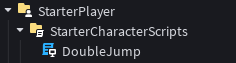

🎥 **Video Showcase:**\
[Vimeo – Double Jump System](https://vimeo.com/1153765406)

---

### ⚡ Elektriker Zap Ability 

**Scripts:** `[CMC]ElektrikerZap.lua` (LocalScript + ServerScript)

A ranged offensive ability used by the **Elektriker** character.

- Player fires an electric discharge toward the mouse position
- On hit, enemies are electrocuted and receive damage
- Ability execution includes animation playback and VFX
- Hit validation and damage applied server-side

**Setup:** The ability works with a `Tool` architecture, which contains a `LocalScript` and a Server `Script` with communication being handled with a `RemoteEvent`, as shown below.

  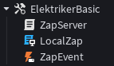

🎥 **Video Showcase:**\
[Vimeo – Elektriker's Zap Ability](https://vimeo.com/1153768446)

---

### 🗡️ Excalibur Special Ability 

**Script:** `[CMC]ExcaliburSpecial.lua`

A special ability used by the **Wurdig** character.

- The player charges their sword with energy
- Visual feedback provided through meshes and particle effects
- Releases a forward energy beam that damages enemies

**Tool Setup:** The ability works with a `Tool` architecture, which contains a `Script`, a sword `Model` and a `Animation` for the ability deploy, as shown below.

  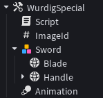

**VFX Setup:** For the rest of the ability logic, theres VFX assets stored separately for reuse, which include `Mesh`es, as shown below.

  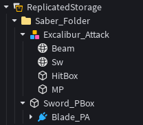

🎥 **Video Showcase:**\
[Vimeo – Wurdig's Energy Sword Beam Ability](https://vimeo.com/1153771328)

---

### 🔥 Fireball Ability 

**Scripts:** `[CMC]FireBall.lua` (LocalScript + ServerScript)

A charged projectile ability used by the **Ledern** character.

- Player charges and launches a fireball toward the mouse position
- On impact, deals damage and deforms the environment
- Spawns crater-like blocks at the impact location

**Tool Setup:** The ability works with a `Tool` architecture, which contains `LocalScript` and Server `Script`, as shown below.

  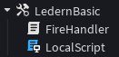

**Assets Setup:** Other shared assets such as the `RemoteEvent` for client/server synchronization and VFXs are stored in `ReplicatedStorage`, as shown below.

  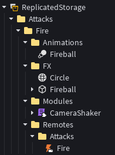

🎥 **Video Showcase:**\
[Vimeo – Ledern's Fireball Ability](https://vimeo.com/1153788454)

📌 *Note:*
To enhance the visual effects and overall impact of this ability, an open-source `ModuleScript` was integrated into the system. This module can be identified within the assets setup and is available in its [original **GitHub** repository, authored by **Sleitnick**.](https://github.com/Sleitnick/RbxCameraShaker)

---

### 🔥 Fire Spear Ability 

**Scripts:** `[CMC]FireSpear.lua` (LocalScript + ServerScript)

A thrown weapon ability used by the **Ledern** character.

- Spawns a fire spear model in the player’s hand
- Spear is thrown toward the target direction
- On hit, enemies are temporarily impaled

**Setup:** The ability works with a `Tool` architecture, which contains a `LocalScript` and a Server `Script` with communication being handled with a `RemoteEvent`, as shown below.

  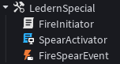

🎥 **Video Showcase:**\
[Vimeo – Ledern's Fire Spear Ability](https://vimeo.com/1153789042)

📌 *Note:*
The fire spear model is stored separately in `ServerStorage` and cloned at runtime.

---

### ❄️ Freize Ice Attack System 

**Script:** `[CMC]FreizeAttacksScript.lua`

A reusable combat system powering both abilities of the **Freize** character.

- Spawns ice spike structures beneath the player
- Spikes deal damage on enemy contact
- Each ability variant features different layouts, sizes, damage, and cooldowns

**Tools Setup:**
The abilities work with a `Tool` architecture, which contains `LocalScript` and Server `Script` each with communication being handled with `RemoteEvent`s, as well as containing some VFXs Tool Handles as shown below.

  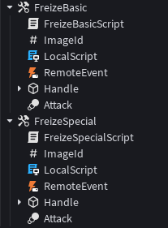

**Assets Setup:**
Each ability `Model`s cloned and spawned at runtime are stored in `ReplicatedStorage`.

  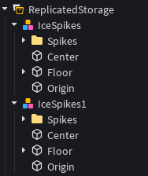

🎥 **Video Showcase:**\
[Vimeo – Freize's Ice Spikes Abilities](https://vimeo.com/1153787428)

---

### 🏹 Knife / Arrow Throw System 

**Script:** `[CMC]KnifeThrow.lua`

A charge-based projectile system reused for both abilities of the **Jager** character.

* Player charges the attack by holding input
* Charge level increases hitbox size and damage potential
* Thrown projectiles embed into enemies or the environment

**Setup:** The abilities work with a `Tool` architecture, which contains a `LocalScript` which handles input along with the abilities respective animation and the weapon models, as shown below.

  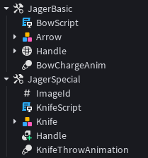

🎥 **Video Showcase:**\
[Vimeo – Jager's Abilities](https://vimeo.com/1153769347)

📌 *Note:*
The server side scripts are located in `ServerScriptService` and connected via `RemoteEvent`s located in `ReplicatedStorage`.

---

## Shared Character State Architecture

All characters include a **Data** folder located within `StarterCharacterScripts`.

- Stores `BoolValue` objects representing temporary or persistent player states
- Used by multiple abilities and systems to coordinate gameplay logic
- Enables clean state checking across independent scripts

  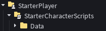

---

## Media & Showcases

All video showcases are hosted on **Vimeo** and demonstrate real in-engine gameplay using the documented systems.

---

## Notes on Reusability

Cruzaders Madness Classic was developed with **system reuse and scalability** in mind.

* Several combat systems are shared across multiple characters
* Abilities follow consistent client/server patterns
* Architecture supports rapid iteration and expansion

These patterns were later reused or adapted in other projects, reinforcing modular and production-ready gameplay design.
