# Cruzaders Madness Remastered – Technical Documentation

## Table of Contents

- [Cruzaders Madness Remastered – Technical Documentation](#cruzaders-madness-remastered--technical-documentation)
  - [Table of Contents](#table-of-contents)
  - [Overview](#overview)
  - [Project Scope](#project-scope)
  - [Implemented Systems](#implemented-systems)
    - [🛡️ Blocking System ](#️-blocking-system-)
    - [⚔️ Combat System ](#️-combat-system-)
    - [🔥 Combat Master Transformation ](#-combat-master-transformation-)
    - [💥 Damage Indicator System ](#-damage-indicator-system-)
    - [💨 Dash Ability ](#-dash-ability-)
    - [💬 Modular Dialogue System ](#-modular-dialogue-system-)
    - [🦘 Double Jump ](#-double-jump-)
    - [🕳️ Floor Impact VFX System ](#️-floor-impact-vfx-system-)
    - [⚡ Sprint \& Stamina System ](#-sprint--stamina-system-)
  - [Shared \& Project-Agnostic Systems](#shared--project-agnostic-systems)
    - [📚 Dictionary Utility Module ](#-dictionary-utility-module-)
  - [Player Spawn \& State Architecture ](#player-spawn--state-architecture-)
  - [Extra Media \& Showcases ](#extra-media--showcases-)
  - [Notes on Reusability](#notes-on-reusability)

## Overview

**Cruzaders Madness Remastered** is a playable 2.5D arcade fighting prototype developed in Roblox, designed around fast-paced combat, expressive movement, and competitive multiplayer encounters.

The project was originally envisioned to feature both a **Story Mode** and an **Arcade Mode**. While the story experience was never completed, the arcade-focused prototype evolved into a polished vertical slice featuring a single playable character, one combat arena, and a multiplayer platform-fighter-style ruleset where up to four players compete, with victory determined by the lowest number of deaths.

Cruzaders Madness Remastered builds directly upon the foundation established by the earlier project [**Cruzaders Madness Classic**](../docs/cruzaders-madness-classic.md), reworking and improving many of its systems while introducing new mechanics, visual feedback, and structural refinements.

---

## Project Scope

This documentation focuses on the **core gameplay, combat, and supporting systems implemented for Cruzaders Madness Remastered**, highlighting architectural decisions, client/server responsibilities, and modular design approaches.

All project-specific scripts are tagged with the **[CMR]** prefix. Scripts without a project tag are considered **shared, modular, or project-agnostic utilities**, reused or adapted during development.

---

## Implemented Systems

### 🛡️ Blocking System 

**Scripts:** [`[CMR]Blocking.lua`](../[CMR]Blocking.lua) (LocalScript + ServerScript)

A toggle-based defensive system allowing players to enter and exit a blocking state by pressing the `F` key.

- Triggers a blocking animation and reduces movement speed
- Sends state updates to the server via a `RemoteEvent`
- Blocking state is evaluated during combat damage resolution
- Implemented as a toggle rather than a held input

Most of the system logic is handled client-side, with the server acting as an authoritative source for player blocking states.

**Setup:**
The system works with a Client/Server architecture handling communication via `RemoteEvent`.
On the client side, inside the `LocalScript` the blocking `Animation` locates, as shown below.

  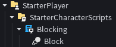

On the server side, there is only a Server `Script` inside `ServerScriptService`.

  

🎥 **Video Showcase:**
[Vimeo – Blocking System](https://vimeo.com/1158230966)

---

### ⚔️ Combat System 

**Scripts:** [`[CMR]Combat.lua`](../[CMR]Combat.lua) (LocalScripts, ServerScript, ModuleScripts)

The central combat framework of the prototype, managing player attacks, damage application, feedback effects, and combat rules.

- Four basic attack chain with knockback on the final hit
- Heavy attack that breaks enemy blocks, applies knockback, and deals increased damage
- Cooldowns enforced between attacks
- Integrated block mitigation logic
- Combat interactions handled through forward-facing, character-attached hitboxes

The system is split across multiple scripts and modules to separate gameplay logic, visual effects (VFX), and sound effects (SFX), enabling cleaner iteration and scalability.

**Logic Setup:**
The logic for the combat system consists in a `LocalScript` inside the players `StarterPack`, which contains `Sound` and `Animation`, as shown below.

  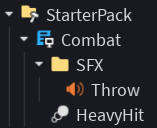

Server sided, the system needs a `Script` inside `ServerScriptService` and two `ModuleScript`s.

  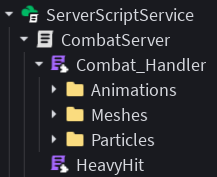

**VFXs Setup:**
For some extra VFXs, there is another `LocalScript` that contains a `ModuleScript`, inside a `Folder` in the `StarterPack`, and some VFX `Mesh`es, as shown below.

  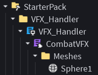

🎥 **Video Showcase:**
[Vimeo – Combat System](https://vimeo.com/1158229365)

---

### 🔥 Combat Master Transformation 

**Scripts:** [`[CMR]CombatMaster.lua`](../[CMR]CombatMaster.lua) (LocalScript + ServerScript)

A temporary transformation mechanic exclusive to the playable character in the prototype.

- Activated upon meeting specific gameplay conditions
- Grants temporary bonuses to damage, health, and movement speed
- Features a short cinematic sequence with layered VFX and SFX
- Includes a dynamic background music change during transformation
- Transformation expires after a fixed duration, reverting all bonuses

**Setup:**
As this script works with a Server/Client + Remote Event architecture, there is a `LocalScript` located in `StarterPlayer > StarterCharacterScripts`, which also contains `Sound`s for SFX and a `Animation` for the transforming sequence.

  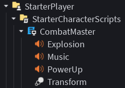

On the server side there is a `Script` located in `ServerScriptService`, with some VFXs objects, such as `ParticleEmitter`, `Mesh` and `Part`, as shown below.

  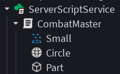

🎥 **Video Showcase:**
[Vimeo – Combat Master Transformation](https://vimeo.com/1158232869)

---

### 💥 Damage Indicator System 

**Script:** [`[CMR]DamageIndicators.lua`](../[CMR]DamageIndicators.lua)

An improved damage feedback system derived from **Cruzaders Madness Classic**.

- Displays health changes using `BillboardGui` elements
- Differentiates between damage taken, healing received, and eliminations
- Shows randomized prewritten text messages upon player elimination

📌 *Note:*
This system expands upon the original [Cruzaders Madness Classic](../docs/cruzaders-madness-classic.md) implementation, which only displayed damage values.

**Setup:**
Works with only a `Script` as `ServerScriptService`'s children, just with some extra `UIGradient`s for spicing up the visuals of the system, as shown below.

  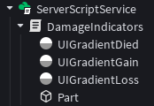

🎥 **Video Showcase:**
[Vimeo – Health Indicators](https://vimeo.com/1158232064)

---

### 💨 Dash Ability 

**Script:** [`[CMR]Dash.lua`](../[CMR]Dash.lua)

A horizontal dash movement ability available in all gameplay states.

- Applies force-based movement using Roblox’s native physics systems
- Temporarily disables player control and physics interaction
- Can be executed at any time

📌 *Note:*
This ability is an enhanced version of the dash mechanic from [Cruzaders Madness Classic](../docs/cruzaders-madness-classic.md), featuring improved visuals and added SFX.

**Setup:**
Works with only a `LocalScript`, located in `StarterPlayer > StarterCharacterScripts`, containing a `Sound`, `Animation` and some GUI elements for extra VFXs.

  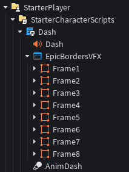

🎥 **Video Showcase:**
[Vimeo – Dash Ability](https://vimeo.com/1158233478)

---

### 💬 Modular Dialogue System 

**Script:** [`[CMR]DialogueSystem.lua`](../[CMR]DialogueSystem.lua)

A fully modular and reusable dialogue presentation system.

- Displays speaker name and animated text output
- Progressive text reveal with synchronized SFX
- Supports multi-line dialogue sequences
- Triggered via server signals from multiple interchangable sources
- Includes input hints and animation skipping

📌 *Note:*
This system is an enhanced version of the dialog system from [Pantharas Age](../docs/pantharas-age.md), featuring creative direction changes, improved visuals and technical functionality.

**Logic Setup:**
The system only needs a `LocalScript` as children of `ScreenGui`, and as a sibling of the `Frame` used to show the dialogs, located in `StarterGui`, containing some `Sound`s for SFXs and player interaction feedback, as shown below.

  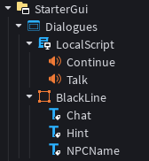

**Multi-Line NPC Dialogue Example:**
Dialogues to show can be easily assigned to achieve different results. As an example, this would be the setup for a NPC to talk more than just one line.

  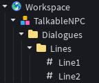

🎥 **Video Showcase:**
[Vimeo – Modular Dialogue System](https://vimeo.com/1158234919)

---

### 🦘 Double Jump 

**Script:** [`[CMR]DoubleJump.lua`](../[CMR]DoubleJump.lua)

A movement enhancement system granting players an additional jump while airborne.

📌 *Note:*
Adapted and optimized from its [Cruzaders Madness Classic](../docs/cruzaders-madness-classic.md) counterpart.

**Setup:**
The ability works with a single `LocalScript` located in `StarterPlayer > StarterCharacterScripts`, containing an `Animation` object for the double jump, as shown below.

  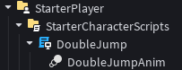

🎥 **Video Showcase:**
[Vimeo – Double Jump](https://vimeo.com/1158236270)

---

### 🕳️ Floor Impact VFX System 

**Scripts:** [`[CMR]FloorVFX.lua`](../[CMR]FloorVFX.lua) (ServerScript + ModuleScript)

A reusable environmental impact effect system.

- Triggered via client-to-server `RemoteEvent`
- Spawns crater-like arrangements inheriting surface properties

**Setup:**
This modular system works only server sided, with a Server `Script` and `ModuleScript`, containing VFX objects such as `Mesh` and `Part`s.

  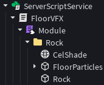

🎥 **Video Showcase:**
[Vimeo – Floor Crater Impact VFX](https://vimeo.com/1158237874)

---

### ⚡ Sprint & Stamina System 

**Scripts:** [`[CMR]SprintStamina.lua`](../[CMR]SprintStamina.lua) (LocalScripts + ServerScript)

A stamina-driven movement system governing sprinting and energy recovery.

- Sprinting until stamina depletion
- Vulnerable charging state toggled with `H` key input
- Visual feedback via VFX, SFX, blur, and screen filters

**Setup:**
As this system consists in more than just one mechanic, it is divided in two `LocalScript`s as `StarterPlayer > StarterCharacterScripts`'s children, each containing their respective children objects to work properly, as shown below.

  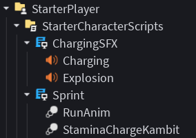

And for the stamina charging part of the system, there is a `Script` located in `ServerScriptService` containing VFXs objects, such as `Mesh` and `Part`.

  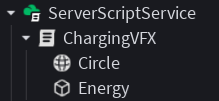

🎥 **Video Showcase:**
[Vimeo – Stamina System](https://vimeo.com/1158238406)

---

## Shared & Project-Agnostic Systems

### 📚 Dictionary Utility Module 

**Script:** [`Dictionary.lua`](../Dictionary.lua) (ModuleScripts)

A general-purpose dictionary utility module used during CMR development.

Works using two server-sided `ModuleScript`

  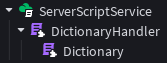

---

## Player Spawn & State Architecture 

**Script:** [`[CMR]PlayerSpawning.lua`](../[CMR]PlayerSpawning.lua)

Manages player initialization, shared state, and visual setup.

- Creates `Actions`, `Habilities`, and `Status` folders per character
- Stores gameplay-critical values (health, stamina, cooldowns, states)
- Values consumed by multiple independent systems
- Players grouped under a centralized `Entities` folder in `Workspace`
- Applies cell shading for visual cohesion

**Setup:**
This player setup process works with a single Server `Script` located in `ServerScriptService`.

**Player Setup Result:**

  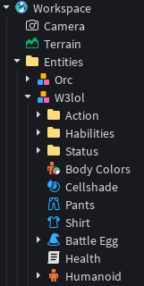

---

## Extra Media & Showcases 

For this project, a [Full Gameplay Match has been uploaded to **YouTube**](https://www.youtube.com/watch?v=D92UzZioSF0), showcasing the documented systems and mechanics operating in real gameplay scenarios with multiple players.
Direct links and timestamps are provided to allow quick access to specific system showcases.

- [Combat Master Transformation, Dialogue System & Floor VFX](https://youtu.be/D92UzZioSF0?si=n8qvyPBhMPtGQFva&t=225)
- [Stamina Charging](https://youtu.be/D92UzZioSF0?si=RT96333i3QqtgVAR&t=200)

**Disclaimer:**
Some assets, such as animations, were not created by me. Additionally, minor bugs, glitches, or inconsistencies may be visible in isolated arcade-mode elements (e.g., other players’ health bars, timers, loading screens, or victory screens).
This project was developed between 2022 and 2023, and as such, the showcased gameplay may not fully reflect my current scripting skills or technical proficiency.

---

## Notes on Reusability

Cruzaders Madness Remastered emphasizes **system iteration and modularity**, refining mechanics from Cruzaders Madness Classic while maintaining reusable, scalable gameplay architecture.
